# CIFAR-10 CNN Training with WandB Integration

**Name:** Laksh Mendpara  
**Roll:** B23CS1037

A comprehensive deep learning experiment for training a ResNet18-style CNN on CIFAR-10 with full experiment tracking, gradient flow analysis, and weight update visualization.

## 🔗 Quick Links

| Resource                  | Link                                                                                                   |
| ------------------------- | ------------------------------------------------------------------------------------------------------ |
| **Google Colab Notebook** | [Open in Colab](https://colab.research.google.com/drive/1ILCjEgsHKy5LvfBNUKoMnOHWGR9Ru87F?usp=sharing) |
| **WandB Dashboard**       | [View Experiment](https://wandb.ai/b23cs1037-iit-jodhpur/cifar10-cnn-mlops/runs/6tbudx0x)              |
| **Training Logs**         | [logs/training_20260201_125724.log](logs/training_20260201_125724.log)                                 |
| **Visualization Plots**   | [plots/](plots/)                                                                                       |

---

## 📋 Table of Contents

- [Project Overview](#project-overview)
- [Model Architecture](#model-architecture)
- [Training Configuration](#training-configuration)
- [Results Summary](#results-summary)
- [Training Analysis](#training-analysis)
- [Gradient Flow Analysis](#gradient-flow-analysis)
- [Weight Distribution Analysis](#weight-distribution-analysis)
- [Weight Updates Analysis](#weight-updates-analysis)
- [Key Findings & Observations](#key-findings--observations)
- [Project Structure](#project-structure)
- [How to Run](#how-to-run)
- [Appendix: All Visualizations](#appendix-all-visualizations)

---

## Project Overview

This project implements a complete deep learning pipeline for image classification on CIFAR-10, featuring:

- ✅ **Custom DataLoader** with advanced data augmentation
- ✅ **ResNet18 adapted for 32×32 images** (modified architecture)
- ✅ **FLOPs counting** using `thop` library
- ✅ **`torch.compile()`** for optimized training
- ✅ **Mixed Precision Training (AMP)** for faster computation
- ✅ **Gradient flow visualization** to monitor training health
- ✅ **Weight distribution tracking** across epochs
- ✅ **Full WandB integration** for experiment tracking

---

## Model Architecture

### ResNet18 for CIFAR-10

The standard ResNet18 is designed for ImageNet (224×224 images). For CIFAR-10 (32×32 images), we made the following adaptations:

| Component  | ImageNet ResNet18 | CIFAR-10 ResNet18 |
| ---------- | ----------------- | ----------------- |
| First Conv | 7×7, stride 2     | 3×3, stride 1     |
| Max Pool   | 3×3, stride 2     | Removed           |
| Input Size | 224×224           | 32×32             |

### Model Specifications

| Metric                   | Value                                      |
| ------------------------ | ------------------------------------------ |
| **Total Parameters**     | 11,173,962 (~11.17M)                       |
| **Trainable Parameters** | 11,173,962 (~11.17M)                       |
| **FLOPs**                | 557.889M                                   |
| **Architecture**         | 4 residual stages with [2, 2, 2, 2] blocks |

---

## Training Configuration

| Hyperparameter        | Value                                |
| --------------------- | ------------------------------------ |
| **Epochs**            | 25                                   |
| **Batch Size**        | 128                                  |
| **Optimizer**         | AdamW                                |
| **Learning Rate**     | 0.001 (with OneCycleLR, max_lr=0.01) |
| **Weight Decay**      | 1e-4                                 |
| **Gradient Clipping** | 1.0                                  |
| **Mixed Precision**   | Enabled (AMP)                        |
| **torch.compile**     | Enabled                              |

### Data Augmentation Pipeline

```python
transforms.Compose([
    RandomCrop(32, padding=4),
    RandomHorizontalFlip(p=0.5),
    RandomRotation(degrees=15),
    ColorJitter(brightness=0.2, contrast=0.2, saturation=0.2, hue=0.1),
    RandomAffine(degrees=0, translate=(0.1, 0.1)),
    ToTensor(),
    Normalize(mean=[0.4914, 0.4822, 0.4465], std=[0.2470, 0.2435, 0.2616]),
    RandomErasing(p=0.25, scale=(0.02, 0.2)),
])
```

---

## Results Summary

### Final Performance

| Metric                       | Value                 |
| ---------------------------- | --------------------- |
| **Best Validation Accuracy** | **81.60%** (Epoch 22) |
| **Final Test Accuracy**      | **81.33%**            |
| **Final Test Loss**          | 1.0984                |
| **Final Training Accuracy**  | 99.07%                |
| **Training Time**            | ~28 minutes           |

### Training Progression

| Epoch | Train Loss | Train Acc | Val Loss | Val Acc    |
| ----- | ---------- | --------- | -------- | ---------- |
| 1     | 1.2536     | 54.20%    | 0.9954   | 63.84%     |
| 5     | 0.2801     | 90.14%    | 0.7688   | 75.34%     |
| 10    | 0.0764     | 97.40%    | 0.8548   | 78.54%     |
| 15    | 0.0469     | 98.38%    | 0.8927   | 80.68%     |
| 20    | 0.0382     | 98.67%    | 1.0772   | 79.76%     |
| 22    | 0.0297     | 98.98%    | 0.9833   | **81.60%** |
| 25    | 0.0277     | 99.07%    | 1.0877   | 79.70%     |

---

## Training Analysis

### Training Curves

The following plots show the training progression over 25 epochs:

#### Loss Curves

| Training Loss                       | Validation Loss                 |
| ----------------------------------- | ------------------------------- |
| 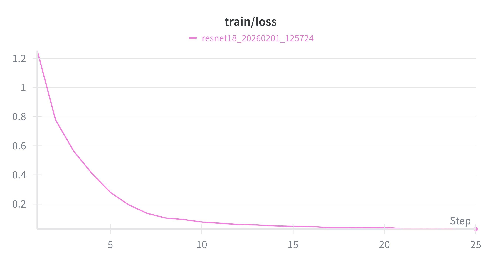 | 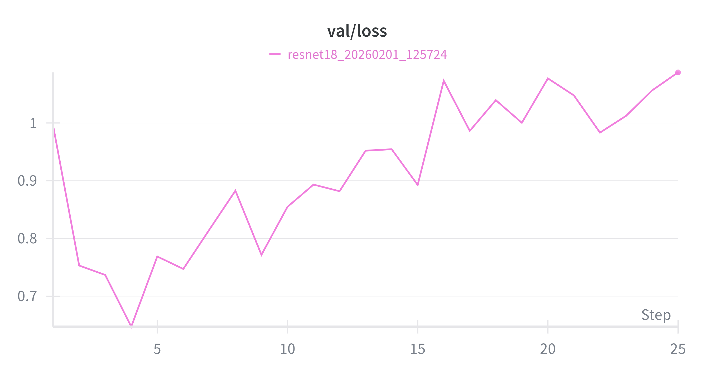 |

**Observations:**

- **Training loss** decreases smoothly from ~1.25 to ~0.03, showing effective learning
- **Validation loss** initially decreases but starts increasing after epoch 5, indicating overfitting

#### Accuracy Curves

| Training Accuracy                      | Validation Accuracy                |
| -------------------------------------- | ---------------------------------- |
| 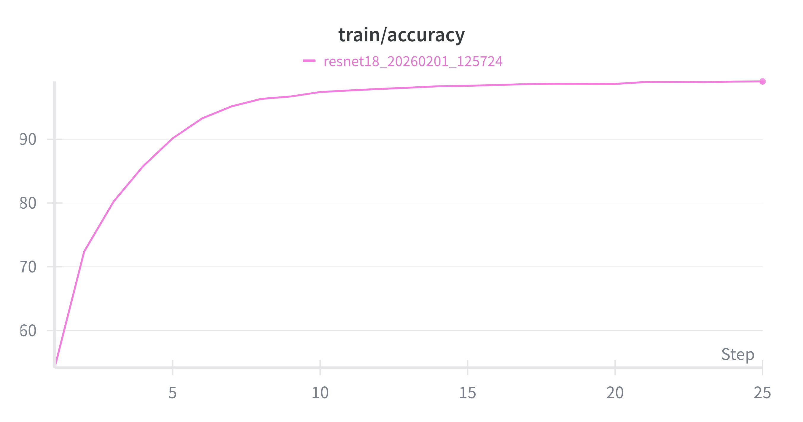 | 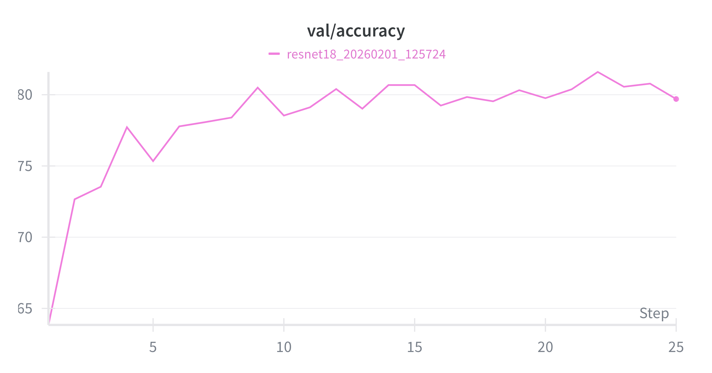 |

**Observations:**

- **Training accuracy** rapidly climbs from ~54% to ~99%, showing the model learned the training data well
- **Validation accuracy** plateaus around 78-81%, with the best at 81.60% (epoch 22)

### Learning Curve Observations

1. **Rapid Initial Learning (Epochs 1-5)**: The model quickly learned basic features, achieving 90% training accuracy by epoch 5.

2. **Validation Plateau (Epochs 10-25)**: While training accuracy continued to climb to 99%+, validation accuracy plateaued around 78-81%, indicating some overfitting.

3. **Overfitting Gap**: The ~18% gap between training (99%) and validation (81%) accuracy suggests the model has memorized training patterns. The aggressive augmentation helps but doesn't fully prevent overfitting.

4. **Best Model Selection**: The best model was saved at epoch 22 with 81.60% validation accuracy, demonstrating the importance of early stopping strategies.

### Sample Predictions

The model correctly classified 15/16 samples in the visualization, showing strong performance across diverse categories:


**Misclassification Analysis**: The model confused an airplane with a cat, likely due to similar color patterns or unusual image angles.

---

## Gradient Flow Analysis

Gradient flow visualization helps identify:

- **Vanishing gradients** (gradients too small in early layers)
- **Exploding gradients** (gradients too large)
- **Dead neurons** (zero gradients)

### Epoch 1 vs Epoch 25 Comparison

| Epoch 1                                                   | Epoch 25                                                 |
| --------------------------------------------------------- | -------------------------------------------------------- |
| 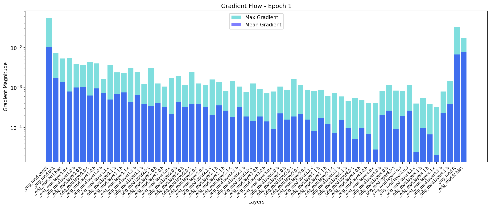 |  |

### Observations

1. **Healthy Gradient Flow**: Gradients remain in the 10⁻⁴ to 10⁻¹ range throughout training, indicating stable optimization.

2. **Residual Connections Working**: The skip connections in ResNet prevent gradient vanishing - we see consistent gradient magnitudes across all layers.

3. **BatchNorm Effect**: Batch normalization layers help normalize gradient magnitudes, visible in the relatively uniform distribution across layers.

4. **FC Layer Gradients**: The final fully-connected layer shows the highest gradients (10⁻¹), which is expected as it directly receives the loss signal.

---

## Weight Distribution Analysis

Tracking weight distributions reveals how the network's parameters evolve during training.

### Epoch 1 vs Epoch 25 Comparison

| Epoch 1                                               | Epoch 25                                                     |
| ----------------------------------------------------- | ------------------------------------------------------------ |
| 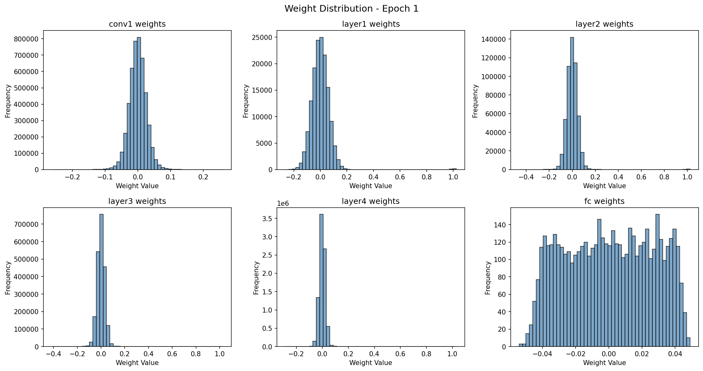 | 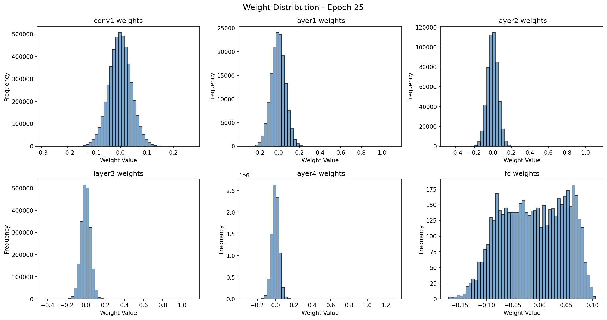 |

### Observations

1. **Narrower Distributions Over Time**: Weight distributions become tighter as training progresses, indicating convergence.

2. **Layer-Specific Patterns**:
   - **conv1**: Weights stay centered around 0 with narrow variance
   - **layer1-layer4**: Gaussian-like distributions centered at 0
   - **fc (final layer)**: Wider distribution spanning -0.1 to 0.1

3. **No Exploding Weights**: All weights remain bounded, confirming stable training with weight decay.

4. **Kaiming Initialization**: The initial distributions show the effect of Kaiming normal initialization, maintaining proper variance for ReLU networks.

---

## Weight Updates Analysis

Weight update magnitudes show how much each layer's parameters change per epoch.

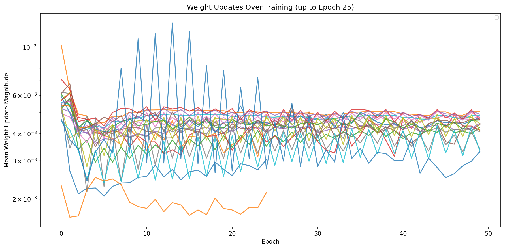

### Observations

1. **OneCycleLR Effect Visible**: The characteristic pattern of OneCycleLR scheduler is evident - updates increase during the first half of training as learning rate ramps up, then decrease in the second half.

2. **Layer-Wise Learning Rates**: Different layers show different update magnitudes:
   - Early layers (conv1) show smaller, more stable updates
   - Later layers show larger, more variable updates

3. **Convergence Pattern**: Update magnitudes generally decrease towards the end of training (~epoch 20-25), indicating the model is approaching a local minimum.

4. **No Layer Collapse**: All layers maintain non-zero updates throughout training, confirming no dead or frozen layers.

---

## Key Findings & Observations

### What Worked Well

1. **ResNet Architecture**: Residual connections effectively combat vanishing gradients, as confirmed by gradient flow analysis.

2. **Data Augmentation**: Rich augmentation (RandomCrop, ColorJitter, RandomErasing) helped regularize the model - without it, overfitting would be much worse.

3. **OneCycleLR Scheduler**: The scheduler's learning rate warm-up and annealing provided effective training dynamics.

4. **Mixed Precision Training**: AMP provided ~1.5-2x speedup without accuracy loss.

5. **torch.compile()**: Provided additional optimization for faster training.

### Areas for Improvement

1. **Overfitting**: The 18% train-val gap suggests room for more regularization (dropout, stronger augmentation, label smoothing).

2. **Model Capacity**: 11M parameters may be excessive for CIFAR-10. A smaller model (ResNet-8 or residual networks with fewer channels) might generalize better.

3. **Longer Training**: With proper regularization, training for 100+ epochs with cosine annealing could improve results.

4. **Advanced Techniques**: Techniques like CutMix, MixUp, or AutoAugment could push accuracy higher.

### Expected vs Actual Performance

| Metric        | Achieved |
| ------------- | -------- |
| Test Accuracy | 81.33%   |

The gap is expected because:

- State-of-the-art uses advanced augmentation (AutoAugment, CutMix)
- Longer training (200+ epochs)
- Learning rate scheduling optimized for CIFAR-10
- Additional regularization (Dropout, Stochastic Depth)

---

## Project Structure

```
MLOps-Laksh-B23CS1037/
├── main.ipynb                 # Main training notebook
├── README.md                  # This file
├── pyproject.toml            # uv project configuration
├── uv.lock                   # Dependency lock file
├── best_model.pth            # Best model checkpoint
├── logs/
│   └── training_20260201_125724.log   # Training logs
└── plots/
    ├── sample_predictions.png
    ├── final_gradient_flow.png
    ├── final_weight_distribution.png
    ├── final_weight_updates.png
    ├── gradient_flow_epoch_{1,5,10,15,20,25}.png
    ├── weight_dist_epoch_{1,5,10,15,20,25}.png
    └── weight_updates_epoch_{1,5,10,15,20,25}.png
```

---

## How to Run

### Prerequisites

- Python 3.11+
- CUDA-capable GPU (recommended)

### Installation

```bash
# Clone the repository
git clone https://github.com/your-username/MLOps-Laksh-B23CS1037.git
cd MLOps-Laksh-B23CS1037

# Install dependencies with uv
uv sync

# Login to WandB (first time only)
uv run wandb login
```

### Running the Notebook

```bash
# Start Jupyter Lab
uv run jupyter lab main.ipynb
```

Or use the [Google Colab link](https://colab.research.google.com/drive/1ILCjEgsHKy5LvfBNUKoMnOHWGR9Ru87F?usp=sharing) for a ready-to-run environment.

---

## Appendix: All Visualizations

### Sample Predictions


---

### Gradient Flow Progression

| Epoch 1                              | Epoch 5                              |
| ------------------------------------ | ------------------------------------ |
|  | 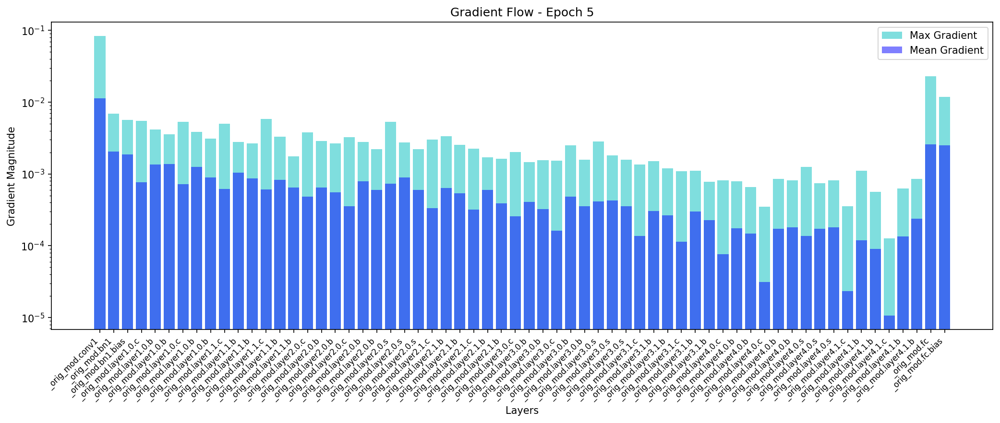 |

| Epoch 10                              | Epoch 15                              |
| ------------------------------------- | ------------------------------------- |
| 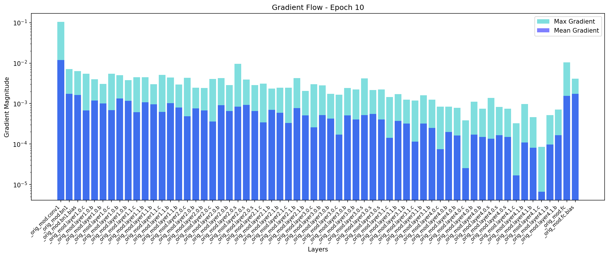 | 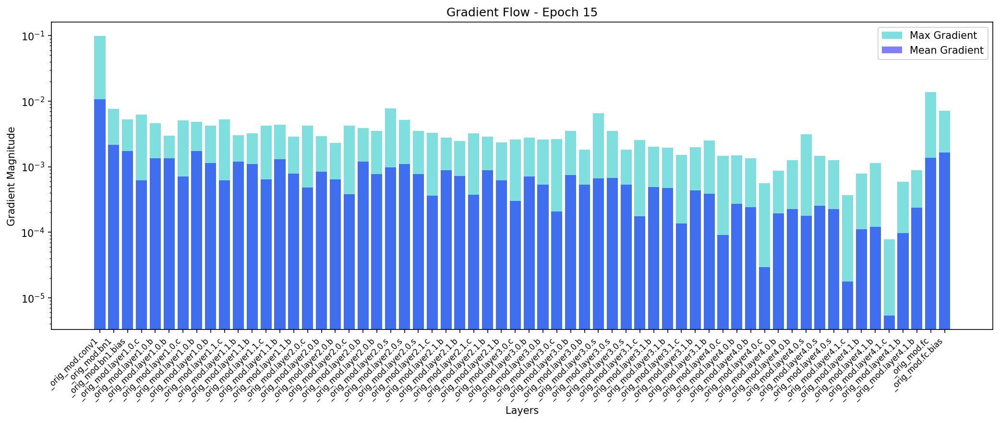 |

| Epoch 20                              | Epoch 25 (Final)                   |
| ------------------------------------- | ---------------------------------- |
| 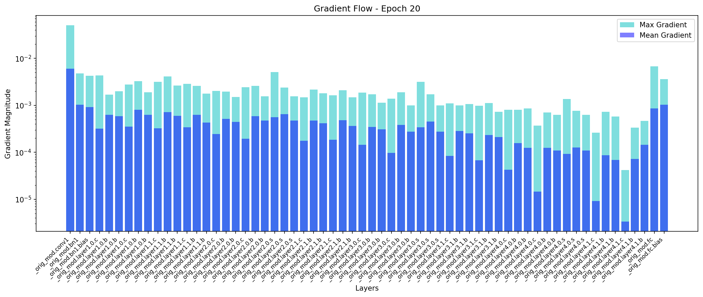 |  |

---

### Weight Distribution Progression

| Epoch 1                            | Epoch 5                            |
| ---------------------------------- | ---------------------------------- |
|  | 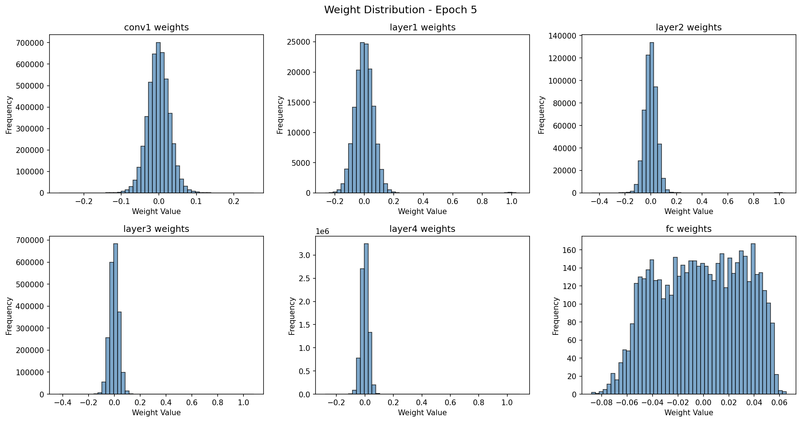 |

| Epoch 10                            | Epoch 15                            |
| ----------------------------------- | ----------------------------------- |
| 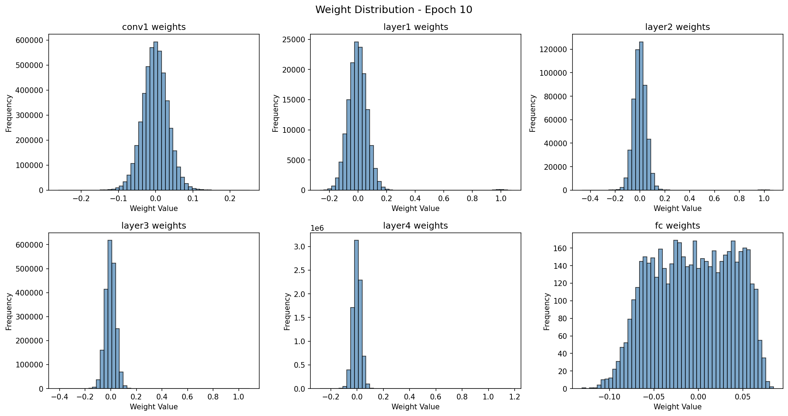 | 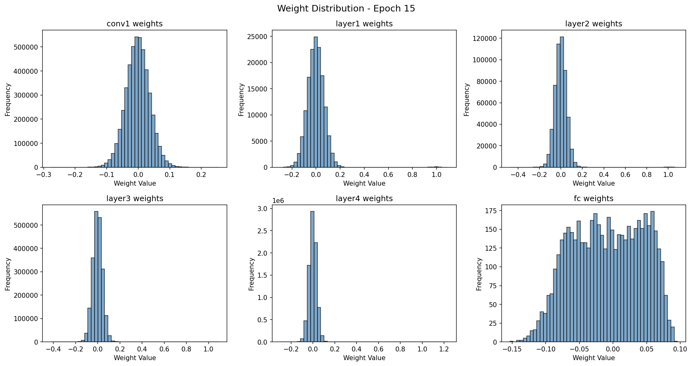 |

| Epoch 20                            | Epoch 25 (Final)                         |
| ----------------------------------- | ---------------------------------------- |
| 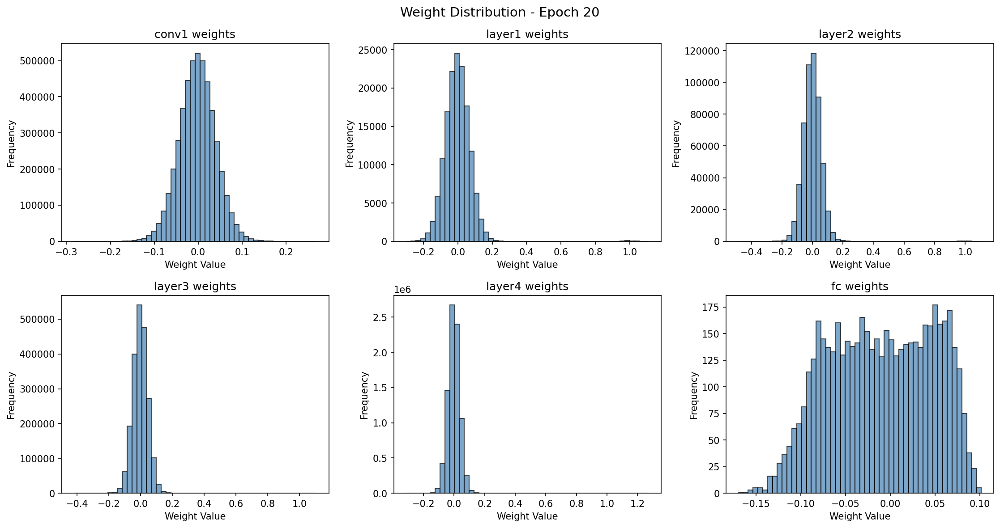 |  |

---

### Weight Updates Progression

| Epoch 1                               | Epoch 5                               |
| ------------------------------------- | ------------------------------------- |
| 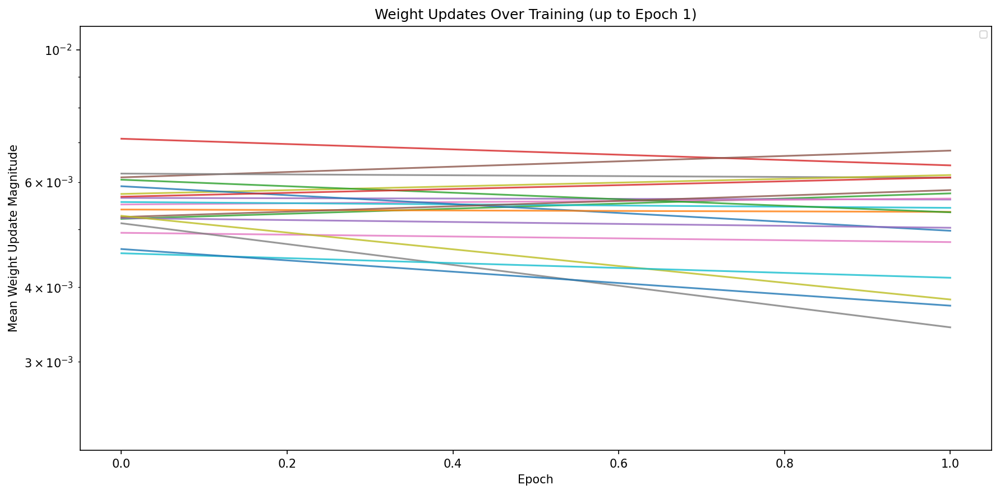 | 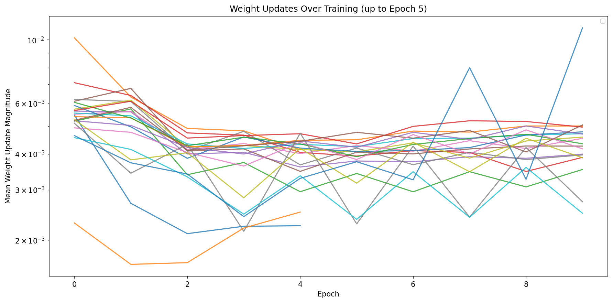 |

| Epoch 10                               | Epoch 15                               |
| -------------------------------------- | -------------------------------------- |
| 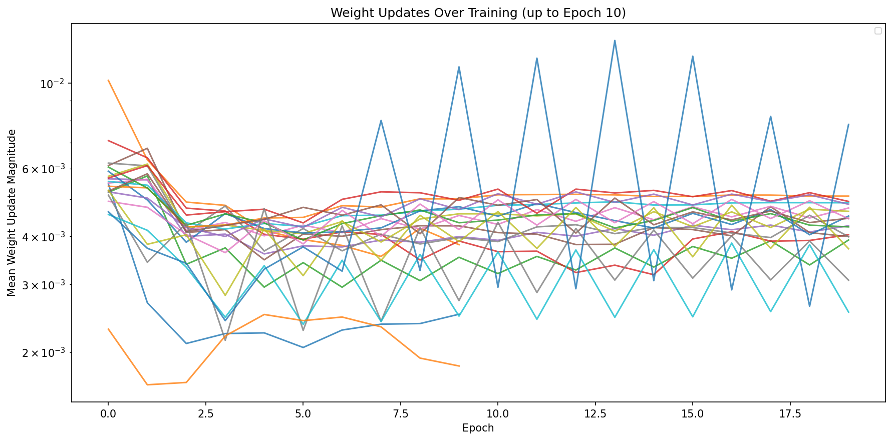 | 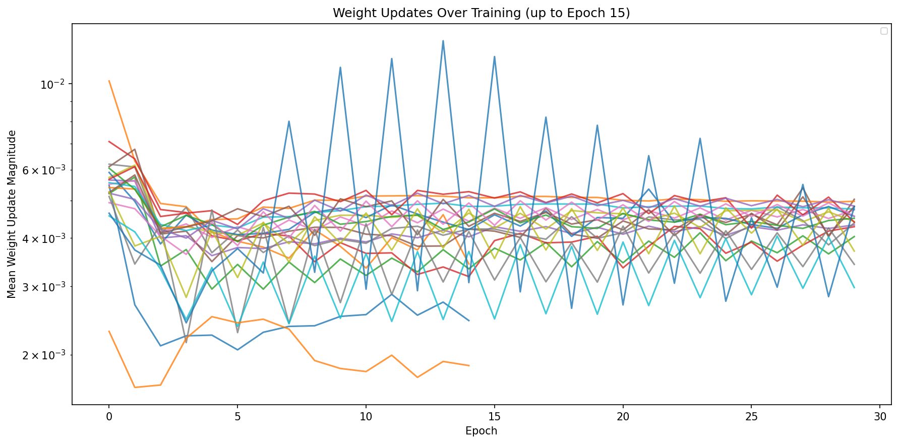 |

| Epoch 20                               | Epoch 25 (Final)                    |
| -------------------------------------- | ----------------------------------- |
| 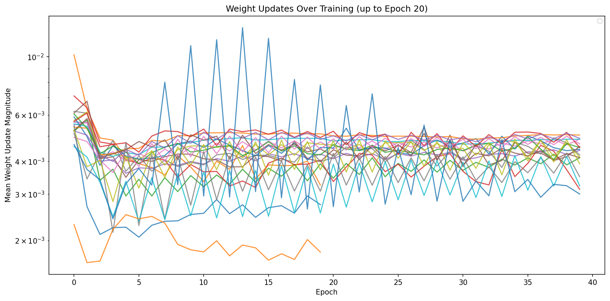 |  |

---

## Author

**B23CS1037** - Laksh Mendpara  
MLOps Lab-2, Worksheet-1

---

## License

This project is for educational purposes as part of the MLOps course at IIT Jodhpur.
