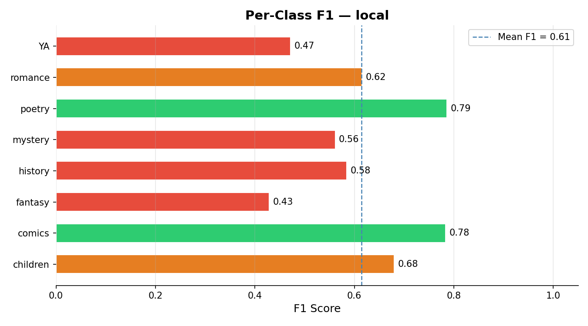
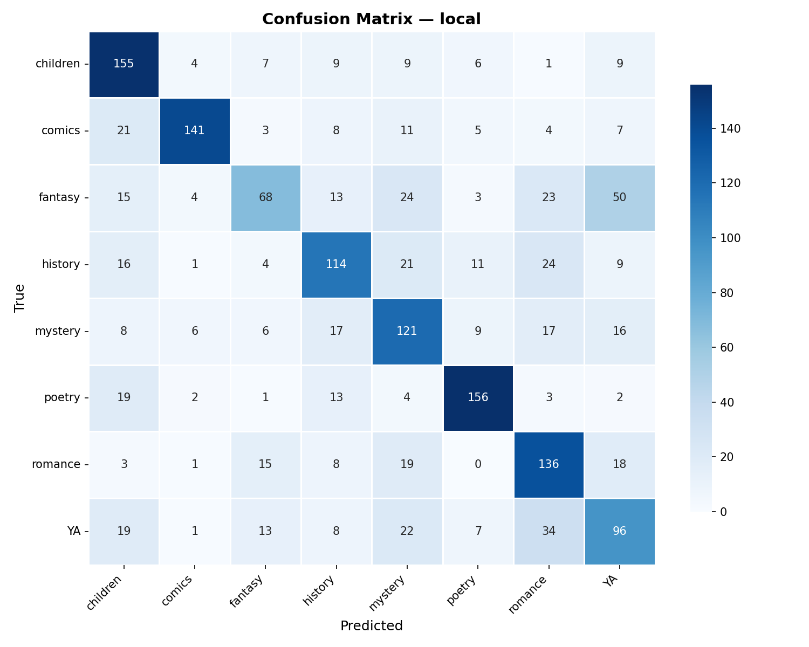
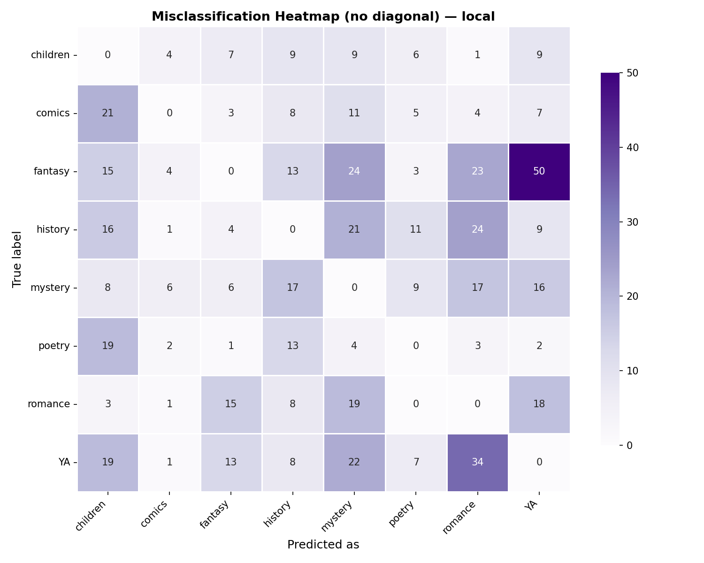

# MLOps Assignment 3 – Fine-Tuning & Docker Deployment

**Student:** Laksh Mendpara &nbsp;|&nbsp; **Roll No:** B23CS1037  
**Branch:** `Assignment-3`

---

## Links

| Resource | URL |
|----------|-----|
| GitHub | [MLOps-Laksh-B23CS1037 / Assignment-3](https://github.com/Laksh-Mendpara/MLOps-Laksh-B23CS1037/tree/Assignment-3) |
| Hugging Face Model | [Laksh-Mendpara / MLOps-Assignment-3](https://huggingface.co/Laksh-Mendpara/MLOps-Assignment-3/tree/main) |

---

## Overview

End-to-end MLOps pipeline:
1. Fine-tune **`roberta-base`** on GoodReads book reviews → 8 genre classes  
2. Dockerize training + production-evaluation pipelines  
3. Publish model to Hugging Face Hub  
4. Re-evaluate from Hub, generate plots & classification report  

---

## Repository Structure

```
MLOps-Laksh-B23CS1037/
├── ML_DL_Ops_Ass_3_Fine_Tuning_Classification.ipynb  ← original notebook
├── src/
│   ├── data.py        ← GoodReads download + train/test split
│   ├── utils.py       ← MyDataset, compute_metrics
│   ├── train.py       ← fine-tune & push to Hub
│   └── evaluate.py    ← eval + plots (local / hub / both)
├── Dockerfile             ← training image
├── Dockerfile.eval        ← production evaluation image
├── entrypoint.sh          ← auto-runs evaluate.py on container start
├── requirements.txt
├── DOCKER_INSTRUCTIONS.txt
├── report.tex             ← LaTeX assignment report
├── results/               ← eval JSON + PNG plots (generated at runtime)
└── logs/                  ← train.log, train_steps.log, eval.log
```

---

## Evaluation Results (roberta-base, 3 epochs)

| Metric | Value |
|--------|-------|
| **Accuracy** | **61.7%** |
| Eval loss | 1.121 |
| Macro F1 | 0.61 |

### Per-Class F1



### Confusion Matrix



### Misclassification Heatmap



---

## Quick Start (Local)

```bash
pip install -r requirements.txt

# Train & push to Hub
python src/train.py --epochs 3 --hf_repo Laksh-Mendpara/MLOps-Assignment-3

# Evaluate local model
python src/evaluate.py --mode local --model_path ./fine-tuned-genre-model

# Evaluate from Hub
python src/evaluate.py --mode hub --hf_repo Laksh-Mendpara/MLOps-Assignment-3

# Compare both (generates accuracy_comparison.png)
python src/evaluate.py --mode both \
    --model_path ./fine-tuned-genre-model \
    --hf_repo    Laksh-Mendpara/MLOps-Assignment-3
```

Logs → `logs/train.log`, `logs/train_steps.log`, `logs/eval.log`  
Plots → `results/confusion_matrix_<tag>.png`, `results/f1_per_class_<tag>.png`, `results/misclassification_heatmap_<tag>.png`

---

## Docker – Training Image

```bash
# Build
docker build -t genre-train .

# Run (GPU, all outputs on host via bind-mount)
docker run --rm -it \
    --gpus all --shm-size=8g \
    --network=host \
    -e HF_TOKEN=$HF_TOKEN \
    -v $(pwd):/app \
    genre-train

# Inside container
python src/train.py --epochs 3 --hf_repo Laksh-Mendpara/MLOps-Assignment-3
```

---

## Docker – Production Evaluation Image (Task 9)

Pulls model from Hub at runtime; runs evaluation on startup.

```bash
# Build
docker build -f Dockerfile.eval -t genre-eval .

# Run
docker run --rm \
    --gpus all --shm-size=8g \
    --network=host \
    -e HF_TOKEN=$HF_TOKEN \
    -e HF_REPO=Laksh-Mendpara/MLOps-Assignment-3 \
    -v $(pwd)/results:/app/results \
    genre-eval
```

See [DOCKER_INSTRUCTIONS.txt](DOCKER_INSTRUCTIONS.txt) for full reference.

---

## Report

Full assignment report: [report.tex](report.tex)  
Compile with: `pdflatex report.tex`
