# MLOps Assignment-5

**Name:** Laksh Mendpara  
**Roll Number:** B23CS0137

## Submission Links

- **GitHub Branch:** [Assignment-5](https://github.com/Laksh-Mendpara/MLOps-Laksh-B23CS1037/tree/Assignment-5)
- **Hugging Face Model:** [ByteMaster01/ViT-S-LoRA-CIFAR100](https://huggingface.co/ByteMaster01/ViT-S-LoRA-CIFAR100)
- **WandB Project:** [MLOps-Assignment-5](https://wandb.ai/b23cs1037-iit-jodhpur/MLOps-Assignment-5?nw=nwuserb23cs1037)
- **Report Source:** [`B23CS0137_Laksh_Mendpara_Ass5.tex`](B23CS0137_Laksh_Mendpara_Ass5.tex)
- **Compiled Report:** [`B23CS0137_Laksh_Mendpara_Ass5.pdf`](B23CS0137_Laksh_Mendpara_Ass5.pdf)

## Overview

This repository contains the full implementation for **Assignment-5**:

- **Q1:** ViT-S / DeiT-S finetuning on CIFAR-100 with baseline head-only finetuning, LoRA sweeps, and the optional partial-unfreeze LoRA experiment.
- **Q2:** Adversarial attacks and adversarial detection on CIFAR-10 using ResNet18 and ResNet34 with IBM ART.

All major outputs are stored under `output/`, including:

- epoch-wise train/validation tables
- train/validation curve plots
- class-wise accuracy histograms
- qualitative adversarial image samples
- saved model weights
- log files

## Repository Structure

- `q1_vit_lora/`: Q1 training, evaluation, LoRA, optional partial-unfreeze experiment, HF push logic.
- `q2_adversarial/`: Q2 clean training, FGSM, PGD/BIM detector training, plotting, reporting.
- `output/q1_vit_lora/`: Q1 outputs, plots, saved adapter weights, logs.
- `output/q2_adversarial/`: Q2 outputs, plots, saved model weights, logs.
- `data/`: local CIFAR-100 and CIFAR-10 dataset cache.

## Environment and Installation

### Local Setup with `uv`

```bash
uv sync
```

### Required Environment Variables

Create a `.env` file:

```env
WANDB_API_KEY=your_wandb_key
HF_Token=your_hf_write_token
HF_REPO_ID=ByteMaster01/ViT-S-LoRA-CIFAR100
```

### GPU Selection

`GPU_INDEX` selects the visible CUDA device:

```bash
GPU_INDEX=3
```

## How to Run

### Q1 Full Run

```bash
GPU_INDEX=3 python q1_vit_lora/run_all.py
```

### Q1 Smoke Test

```bash
GPU_INDEX=3 python q1_vit_lora/run_all.py --test
```

### Q1 Optuna Search

```bash
GPU_INDEX=3 python q1_vit_lora/optuna_search.py
```

### Q2 Full Run

```bash
GPU_INDEX=3 python q2_adversarial/run_all.py
```

### Q2 Smoke Test

```bash
GPU_INDEX=3 python q2_adversarial/run_all.py --test
```

### Equivalent `uv run` Commands

```bash
GPU_INDEX=3 uv run python q1_vit_lora/run_all.py
GPU_INDEX=3 uv run python q1_vit_lora/optuna_search.py
GPU_INDEX=3 uv run python q2_adversarial/run_all.py
```

## Output Files

### Q1 Outputs

- `output/q1_vit_lora/q1_vit_lora.log`
- `output/q1_vit_lora/q1_test_results_table.csv`
- `output/q1_vit_lora/*_train_val_table.csv`
- `output/q1_vit_lora/*_train_val_curves.png`
- `output/q1_vit_lora/*_class_acc.png`
- `output/q1_vit_lora/*_lora_grad_norm.png`
- `output/q1_vit_lora/q1_lora_accuracy_heatmap.png`
- `output/q1_vit_lora/best_model/adapter_model.safetensors`
- `output/q1_vit_lora/best_model/adapter_config.json`

### Q2 Outputs

- `output/q2_adversarial/q2_adversarial.log`
- `output/q2_adversarial/clean_resnet18_train_val_table.csv`
- `output/q2_adversarial/clean_resnet18_train_val_curves.png`
- `output/q2_adversarial/fgsm_accuracy_comparison.csv`
- `output/q2_adversarial/detector_accuracy_comparison.csv`
- `output/q2_adversarial/*_detector_train_val_table.csv`
- `output/q2_adversarial/*_detector_train_val_curves.png`
- `output/q2_adversarial/*.png`
- `output/q2_adversarial/resnet18_clean.pth`
- `output/q2_adversarial/detector_PGD.pth`
- `output/q2_adversarial/detector_BIM.pth`

## Final Result Snapshot

| Experiment | Model | Metric | Result |
|------------|-------|--------|--------|
| Q1 Baseline | DeiT-S head-only | Test Accuracy | 73.63% |
| Q1 Best LoRA | DeiT-S + LoRA (r=8, alpha=4) | Test Accuracy | 85.32% |
| Q1 Step-7 Optional | Partial-unfreeze LoRA (r=8, alpha=4) | Test Accuracy | 85.18% |
| Q2 Clean | ResNet18 | Test Accuracy | 93.23% |
| Q2 PGD Detector | ResNet34 | Test Accuracy | 100.00% |
| Q2 BIM Detector | ResNet34 | Test Accuracy | 99.99% |

---

# Q1 Detailed Results

## Q1 Task Summary

For Q1, the pre-trained **`facebook/deit-small-patch16-224`** model was adapted to **CIFAR-100** using:

1. a baseline classifier-head-only finetuning setup
2. LoRA on attention `query`, `key`, and `value`
3. rank values `{2, 4, 8}`
4. alpha values `{2, 4, 8}`
5. fixed dropout `0.1`
6. an optional step-7 partial-unfreeze LoRA experiment using the best observed configuration

## Q1 Assignment Checklist

| Requirement | Result | Status |
|------------|--------|--------|
| Finetune ViT classification head without LoRA | Implemented and completed | Met |
| LoRA on Q, K, V attention weights | Implemented | Met |
| Experiments for ranks 2, 4, 8 and alpha 2, 4, 8 | Completed | Met |
| Train-val tables and graphs | Saved for all runs | Met |
| Class-wise test accuracy histogram | Saved for all runs | Met |
| Gradient update graph on LoRA weights during training | Saved for best LoRA and partial-unfreeze runs, logged on WandB | Met |
| Final testing summary table | `q1_test_results_table.csv` | Met |
| Best model pushed to Hugging Face | Uploaded | Met |
| Optional partial-unfreeze LoRA experiment | Completed | Met |
| Optuna search implementation | `q1_vit_lora/optuna_search.py` | Implemented |

## Q1 Test Results Table

Source: [`output/q1_vit_lora/q1_test_results_table.csv`](output/q1_vit_lora/q1_test_results_table.csv)

| LoRA layers | Rank | Alpha | Dropout | Overall Test Accuracy (%) | Trainable Parameters |
|------------|------|-------|---------|----------------------------|----------------------|
| without | - | - | 0.1 | 73.63 | 38,500 |
| with | 2 | 2 | 0.1 | 84.94 | 93,796 |
| with | 2 | 4 | 0.1 | 84.51 | 93,796 |
| with | 2 | 8 | 0.1 | 84.27 | 93,796 |
| with | 4 | 2 | 0.1 | 85.01 | 149,092 |
| with | 4 | 4 | 0.1 | 85.01 | 149,092 |
| with | 4 | 8 | 0.1 | 84.93 | 149,092 |
| with | 8 | 2 | 0.1 | 85.01 | 259,684 |
| with | 8 | 4 | 0.1 | 85.32 | 259,684 |
| with | 8 | 8 | 0.1 | 85.25 | 259,684 |
| with (partial-unfreeze last 2) | 8 | 4 | 0.1 | 85.18 | 222,820 |

### Best Configuration

- **Best configuration from the completed LoRA sweep:** `r = 8`, `alpha = 4`
- **Best test accuracy:** `85.32%`
- **Uploaded Hugging Face adapter:** [ByteMaster01/ViT-S-LoRA-CIFAR100](https://huggingface.co/ByteMaster01/ViT-S-LoRA-CIFAR100)

## Q1 LoRA Sweep Visualization

The heatmap below summarizes the test accuracy across all rank/alpha combinations.

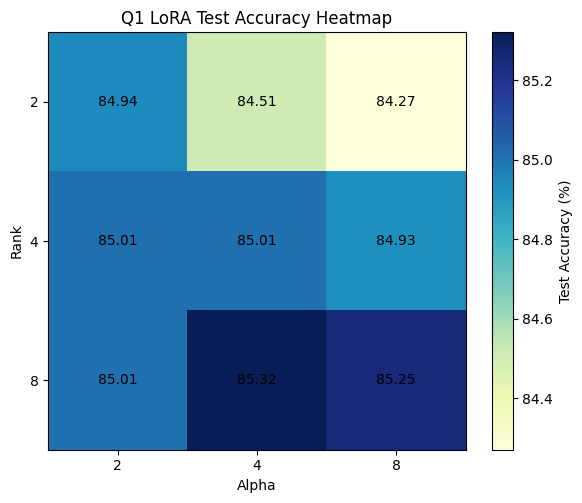

### Q1 Sweep Analysis

- The baseline head-only finetuning reached **73.63%** test accuracy.
- Every LoRA configuration significantly outperformed the baseline.
- The strongest observed result came from **rank 8, alpha 4** with **85.32%** test accuracy.
- Increasing rank generally helped, but the performance gain was not strictly monotonic for every alpha.
- The optional partial-unfreeze experiment achieved **85.18%**, which is very close to the best frozen-backbone LoRA result but not better in this run.

## Q1 Baseline: Head-Only Finetuning

### Train-Val Table

Source: [`output/q1_vit_lora/baseline_no_lora_train_val_table.csv`](output/q1_vit_lora/baseline_no_lora_train_val_table.csv)

| Epoch | Train Loss | Val Loss | Train Accuracy (%) | Val Accuracy (%) |
|------:|-----------:|---------:|-------------------:|-----------------:|
| 1 | 1.5442 | 1.0790 | 64.17 | 70.05 |
| 2 | 0.9458 | 0.9854 | 73.36 | 71.73 |
| 3 | 0.8418 | 0.9583 | 75.76 | 72.39 |
| 4 | 0.7773 | 0.9402 | 77.46 | 72.79 |
| 5 | 0.7342 | 0.9340 | 78.66 | 73.10 |
| 6 | 0.7025 | 0.9240 | 79.58 | 73.36 |
| 7 | 0.6761 | 0.9201 | 80.35 | 73.38 |
| 8 | 0.6581 | 0.9174 | 80.87 | 73.61 |
| 9 | 0.6465 | 0.9136 | 81.17 | 73.63 |
| 10 | 0.6394 | 0.9129 | 81.46 | 73.60 |

### Baseline Plots

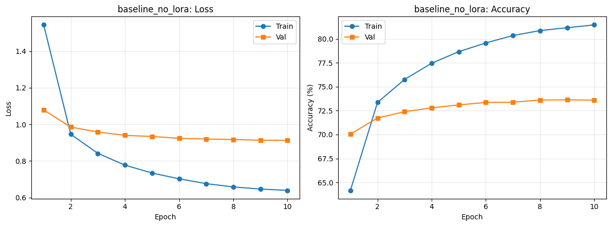

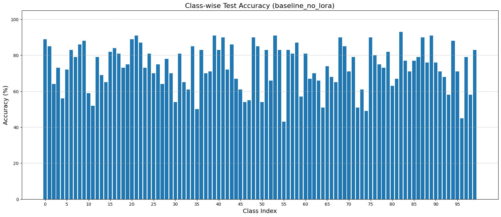

## Q1 Best LoRA Run: `r = 8`, `alpha = 4`

### Train-Val Table

Source: [`output/q1_vit_lora/lora_r8_alpha4_train_val_table.csv`](output/q1_vit_lora/lora_r8_alpha4_train_val_table.csv)

| Epoch | Train Loss | Val Loss | Train Accuracy (%) | Val Accuracy (%) |
|------:|-----------:|---------:|-------------------:|-----------------:|
| 1 | 0.8802 | 0.5723 | 76.08 | 82.24 |
| 2 | 0.4407 | 0.5228 | 86.03 | 83.88 |
| 3 | 0.3294 | 0.5149 | 89.46 | 84.19 |
| 4 | 0.2427 | 0.5149 | 92.32 | 85.13 |
| 5 | 0.1744 | 0.5138 | 94.64 | 85.03 |
| 6 | 0.1242 | 0.5307 | 96.55 | 85.14 |
| 7 | 0.0899 | 0.5411 | 97.85 | 85.21 |
| 8 | 0.0672 | 0.5475 | 98.73 | 85.19 |
| 9 | 0.0546 | 0.5473 | 99.14 | 85.32 |
| 10 | 0.0482 | 0.5484 | 99.31 | 85.32 |

### Best LoRA Plots

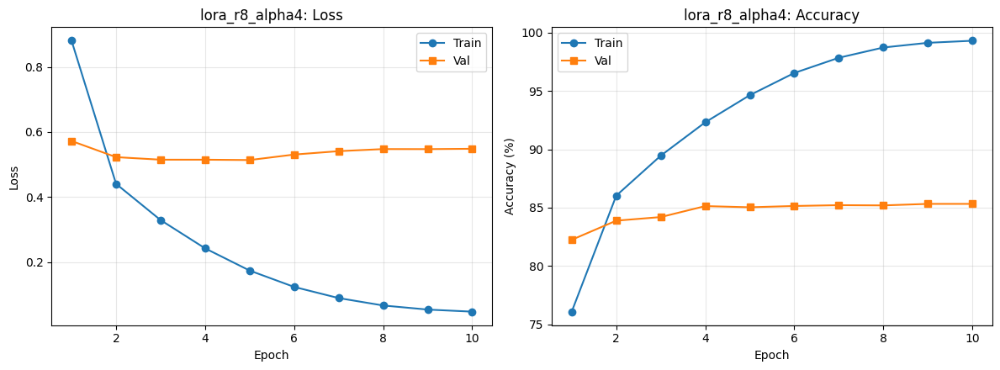

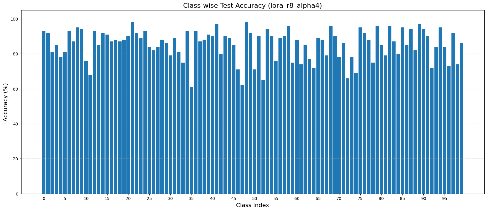

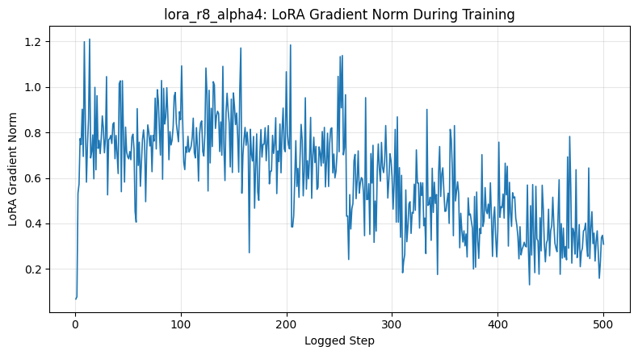

### Best LoRA Analysis

- LoRA dramatically improves performance over the baseline while keeping the number of trainable parameters much smaller than full-model finetuning.
- The best run improved test accuracy from **73.63%** to **85.32%**.
- The train-val curves show rapid early improvement followed by stable validation accuracy around **85%**.
- The gradient norm plot confirms that the LoRA adapter weights received meaningful updates during training.

## Q1 Optional Step-7: Partial-Unfreeze LoRA

### Train-Val Table

Source: [`output/q1_vit_lora/partial_unfreeze_lora_r8_alpha4_train_val_table.csv`](output/q1_vit_lora/partial_unfreeze_lora_r8_alpha4_train_val_table.csv)

| Epoch | Train Loss | Val Loss | Train Accuracy (%) | Val Accuracy (%) |
|------:|-----------:|---------:|-------------------:|-----------------:|
| 1 | 0.9030 | 0.5660 | 75.76 | 82.53 |
| 2 | 0.4477 | 0.5278 | 85.91 | 83.94 |
| 3 | 0.3391 | 0.5137 | 89.29 | 84.33 |
| 4 | 0.2577 | 0.5158 | 91.90 | 84.81 |
| 5 | 0.1944 | 0.5250 | 94.05 | 84.71 |
| 6 | 0.1465 | 0.5274 | 95.79 | 84.93 |
| 7 | 0.1098 | 0.5338 | 97.33 | 85.00 |
| 8 | 0.0863 | 0.5389 | 98.18 | 85.10 |
| 9 | 0.0725 | 0.5414 | 98.61 | 85.04 |
| 10 | 0.0657 | 0.5409 | 98.92 | 85.18 |

### Partial-Unfreeze Plots

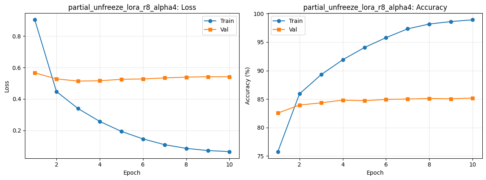

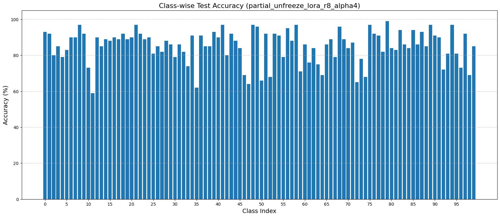

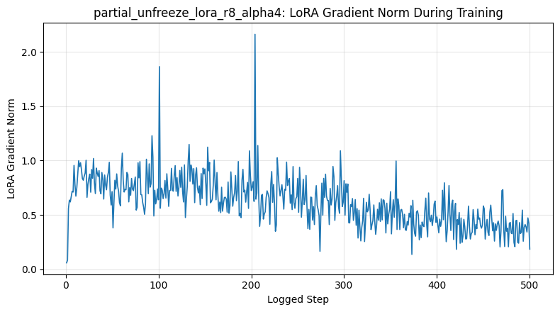

### Partial-Unfreeze Analysis

- The optional step-7 setup used the best observed LoRA hyperparameters from the sweep: `r=8`, `alpha=4`.
- The last `2` encoder blocks were kept trainable while LoRA was applied to the earlier frozen blocks.
- This achieved **85.18%**, which is very close to the best pure LoRA result but slightly lower than **85.32%**.
- In this experiment, partial unfreezing did not provide a further improvement over the best fully frozen-backbone LoRA setup.

## Q1 Additional Experiment Files

### All Q1 Train-Val Tables

- [`output/q1_vit_lora/baseline_no_lora_train_val_table.csv`](output/q1_vit_lora/baseline_no_lora_train_val_table.csv)
- [`output/q1_vit_lora/lora_r2_alpha2_train_val_table.csv`](output/q1_vit_lora/lora_r2_alpha2_train_val_table.csv)
- [`output/q1_vit_lora/lora_r2_alpha4_train_val_table.csv`](output/q1_vit_lora/lora_r2_alpha4_train_val_table.csv)
- [`output/q1_vit_lora/lora_r2_alpha8_train_val_table.csv`](output/q1_vit_lora/lora_r2_alpha8_train_val_table.csv)
- [`output/q1_vit_lora/lora_r4_alpha2_train_val_table.csv`](output/q1_vit_lora/lora_r4_alpha2_train_val_table.csv)
- [`output/q1_vit_lora/lora_r4_alpha4_train_val_table.csv`](output/q1_vit_lora/lora_r4_alpha4_train_val_table.csv)
- [`output/q1_vit_lora/lora_r4_alpha8_train_val_table.csv`](output/q1_vit_lora/lora_r4_alpha8_train_val_table.csv)
- [`output/q1_vit_lora/lora_r8_alpha2_train_val_table.csv`](output/q1_vit_lora/lora_r8_alpha2_train_val_table.csv)
- [`output/q1_vit_lora/lora_r8_alpha4_train_val_table.csv`](output/q1_vit_lora/lora_r8_alpha4_train_val_table.csv)
- [`output/q1_vit_lora/lora_r8_alpha8_train_val_table.csv`](output/q1_vit_lora/lora_r8_alpha8_train_val_table.csv)
- [`output/q1_vit_lora/partial_unfreeze_lora_r8_alpha4_train_val_table.csv`](output/q1_vit_lora/partial_unfreeze_lora_r8_alpha4_train_val_table.csv)

### All Q1 Train-Val Curve Plots

- [`output/q1_vit_lora/baseline_no_lora_train_val_curves.png`](output/q1_vit_lora/baseline_no_lora_train_val_curves.png)
- [`output/q1_vit_lora/lora_r2_alpha2_train_val_curves.png`](output/q1_vit_lora/lora_r2_alpha2_train_val_curves.png)
- [`output/q1_vit_lora/lora_r2_alpha4_train_val_curves.png`](output/q1_vit_lora/lora_r2_alpha4_train_val_curves.png)
- [`output/q1_vit_lora/lora_r2_alpha8_train_val_curves.png`](output/q1_vit_lora/lora_r2_alpha8_train_val_curves.png)
- [`output/q1_vit_lora/lora_r4_alpha2_train_val_curves.png`](output/q1_vit_lora/lora_r4_alpha2_train_val_curves.png)
- [`output/q1_vit_lora/lora_r4_alpha4_train_val_curves.png`](output/q1_vit_lora/lora_r4_alpha4_train_val_curves.png)
- [`output/q1_vit_lora/lora_r4_alpha8_train_val_curves.png`](output/q1_vit_lora/lora_r4_alpha8_train_val_curves.png)
- [`output/q1_vit_lora/lora_r8_alpha2_train_val_curves.png`](output/q1_vit_lora/lora_r8_alpha2_train_val_curves.png)
- [`output/q1_vit_lora/lora_r8_alpha4_train_val_curves.png`](output/q1_vit_lora/lora_r8_alpha4_train_val_curves.png)
- [`output/q1_vit_lora/lora_r8_alpha8_train_val_curves.png`](output/q1_vit_lora/lora_r8_alpha8_train_val_curves.png)
- [`output/q1_vit_lora/partial_unfreeze_lora_r8_alpha4_train_val_curves.png`](output/q1_vit_lora/partial_unfreeze_lora_r8_alpha4_train_val_curves.png)

### All Q1 Class-Wise Accuracy Histograms

- [`output/q1_vit_lora/baseline_no_lora_class_acc.png`](output/q1_vit_lora/baseline_no_lora_class_acc.png)
- [`output/q1_vit_lora/lora_r2_alpha2_class_acc.png`](output/q1_vit_lora/lora_r2_alpha2_class_acc.png)
- [`output/q1_vit_lora/lora_r2_alpha4_class_acc.png`](output/q1_vit_lora/lora_r2_alpha4_class_acc.png)
- [`output/q1_vit_lora/lora_r2_alpha8_class_acc.png`](output/q1_vit_lora/lora_r2_alpha8_class_acc.png)
- [`output/q1_vit_lora/lora_r4_alpha2_class_acc.png`](output/q1_vit_lora/lora_r4_alpha2_class_acc.png)
- [`output/q1_vit_lora/lora_r4_alpha4_class_acc.png`](output/q1_vit_lora/lora_r4_alpha4_class_acc.png)
- [`output/q1_vit_lora/lora_r4_alpha8_class_acc.png`](output/q1_vit_lora/lora_r4_alpha8_class_acc.png)
- [`output/q1_vit_lora/lora_r8_alpha2_class_acc.png`](output/q1_vit_lora/lora_r8_alpha2_class_acc.png)
- [`output/q1_vit_lora/lora_r8_alpha4_class_acc.png`](output/q1_vit_lora/lora_r8_alpha4_class_acc.png)
- [`output/q1_vit_lora/lora_r8_alpha8_class_acc.png`](output/q1_vit_lora/lora_r8_alpha8_class_acc.png)
- [`output/q1_vit_lora/partial_unfreeze_lora_r8_alpha4_class_acc.png`](output/q1_vit_lora/partial_unfreeze_lora_r8_alpha4_class_acc.png)

### Q1 Gradient Update Graphs

- [`output/q1_vit_lora/lora_r8_alpha4_lora_grad_norm.png`](output/q1_vit_lora/lora_r8_alpha4_lora_grad_norm.png)
- [`output/q1_vit_lora/partial_unfreeze_lora_r8_alpha4_lora_grad_norm.png`](output/q1_vit_lora/partial_unfreeze_lora_r8_alpha4_lora_grad_norm.png)

---

# Q2 Detailed Results

## Q2 Task Summary

Q2 contains two parts:

1. **FGSM attack comparison** on CIFAR-10 using a non-pretrained ResNet18:
   - from-scratch FGSM
   - IBM ART FGSM
2. **Adversarial detection** on CIFAR-10 using ResNet34:
   - clean vs PGD adversarial
   - clean vs BIM adversarial

## Q2 Assignment Requirement Checklist

| Requirement | Result | Status |
|------------|--------|--------|
| Train ResNet18 on clean CIFAR-10 with test accuracy at least 72% | 93.23% | Met |
| Implement FGSM from scratch | Implemented and evaluated across 7 epsilon values | Met |
| Implement FGSM using IBM ART | Implemented and evaluated across 7 epsilon values | Met |
| Show original vs adversarial samples for FGSM without ART | `fgsm_scratch_samples.png` | Met |
| Show original vs adversarial samples for FGSM with ART | `fgsm_art_samples.png` | Met |
| Report clean vs adversarial accuracy | `fgsm_accuracy_comparison.csv` | Met |
| Report perturbation strength vs performance drop | `accuracy_drop.png` and FGSM table | Met |
| Train PGD detector with ResNet34 | Test accuracy 100.00% | Met |
| Train BIM detector with ResNet34 | Test accuracy 99.99% | Met |
| Detector accuracy at least 70% | PGD: 100.00%, BIM: 99.99% | Met |
| Compare PGD and BIM | `detector_accuracy_comparison.csv` | Met |
| Show 10 clean/adversarial samples on WandB for FGSM, PGD, BIM | Logged and saved locally | Met |

## Q2 Clean ResNet18 Training

The clean classifier was trained from scratch on CIFAR-10 using a non-pretrained ResNet18. The final **test accuracy was 93.23%**, which is well above the assignment threshold.

Source: [`output/q2_adversarial/clean_resnet18_train_val_table.csv`](output/q2_adversarial/clean_resnet18_train_val_table.csv)

| Epoch | Train Loss | Val Loss | Train Accuracy (%) | Val Accuracy (%) | LR |
|------:|-----------:|---------:|-------------------:|-----------------:|---:|
| 1 | 2.2872 | 1.8530 | 20.82 | 33.38 | 0.099726 |
| 2 | 1.7370 | 1.8047 | 40.57 | 43.00 | 0.098907 |
| 3 | 1.4840 | 1.4311 | 54.73 | 57.40 | 0.097553 |
| 4 | 1.2864 | 1.2747 | 64.66 | 65.70 | 0.095677 |
| 5 | 1.1601 | 1.1621 | 70.75 | 70.96 | 0.093301 |
| 6 | 1.0492 | 1.1471 | 75.94 | 71.74 | 0.090451 |
| 7 | 0.9801 | 1.1152 | 79.21 | 73.64 | 0.087157 |
| 8 | 0.9332 | 0.9567 | 81.27 | 80.02 | 0.083457 |
| 9 | 0.8982 | 1.0578 | 82.78 | 76.06 | 0.079389 |
| 10 | 0.8683 | 1.0117 | 84.04 | 78.36 | 0.075000 |
| 11 | 0.8441 | 0.9515 | 85.08 | 80.36 | 0.070337 |
| 12 | 0.8261 | 0.9394 | 86.14 | 80.52 | 0.065451 |
| 13 | 0.8047 | 0.8440 | 86.85 | 84.78 | 0.060396 |
| 14 | 0.7821 | 0.8695 | 87.83 | 83.36 | 0.055226 |
| 15 | 0.7668 | 0.9573 | 88.58 | 80.44 | 0.050000 |
| 16 | 0.7447 | 0.8083 | 89.54 | 86.56 | 0.044774 |
| 17 | 0.7265 | 0.7956 | 90.27 | 87.16 | 0.039604 |
| 18 | 0.7066 | 0.8120 | 91.14 | 86.50 | 0.034549 |
| 19 | 0.6867 | 0.8218 | 92.04 | 85.94 | 0.029663 |
| 20 | 0.6658 | 0.7512 | 92.99 | 89.06 | 0.025000 |
| 21 | 0.6437 | 0.7426 | 94.00 | 89.32 | 0.020611 |
| 22 | 0.6260 | 0.7388 | 94.76 | 89.74 | 0.016543 |
| 23 | 0.6059 | 0.6930 | 95.67 | 91.56 | 0.012843 |
| 24 | 0.5845 | 0.6809 | 96.59 | 92.10 | 0.009549 |
| 25 | 0.5670 | 0.6890 | 97.33 | 92.02 | 0.006699 |
| 26 | 0.5525 | 0.6759 | 97.99 | 92.80 | 0.004323 |
| 27 | 0.5402 | 0.6649 | 98.58 | 93.22 | 0.002447 |
| 28 | 0.5321 | 0.6581 | 98.94 | 93.46 | 0.001093 |
| 29 | 0.5281 | 0.6540 | 99.12 | 93.70 | 0.000274 |
| 30 | 0.5253 | 0.6548 | 99.24 | 93.62 | 0.000000 |

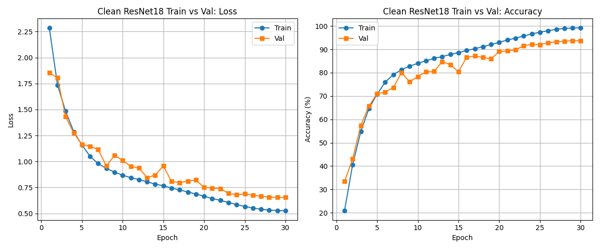

## Q2 FGSM Attack: Scratch vs IBM ART

Source: [`output/q2_adversarial/fgsm_accuracy_comparison.csv`](output/q2_adversarial/fgsm_accuracy_comparison.csv)

| Epsilon | Clean Accuracy (%) | FGSM Scratch Accuracy (%) | FGSM ART Accuracy (%) | Scratch Drop (%) | ART Drop (%) |
|--------:|-------------------:|--------------------------:|----------------------:|-----------------:|-------------:|
| 0.00 | 93.23 | 93.23 | 93.23 | 0.00 | 0.00 |
| 0.05 | 93.23 | 43.00 | 46.01 | 50.23 | 47.22 |
| 0.10 | 93.23 | 14.25 | 14.92 | 78.98 | 78.31 |
| 0.15 | 93.23 | 10.93 | 11.30 | 82.30 | 81.93 |
| 0.20 | 93.23 | 10.61 | 10.83 | 82.62 | 82.40 |
| 0.25 | 93.23 | 10.43 | 10.31 | 82.80 | 82.92 |
| 0.30 | 93.23 | 10.33 | 10.35 | 82.90 | 82.88 |

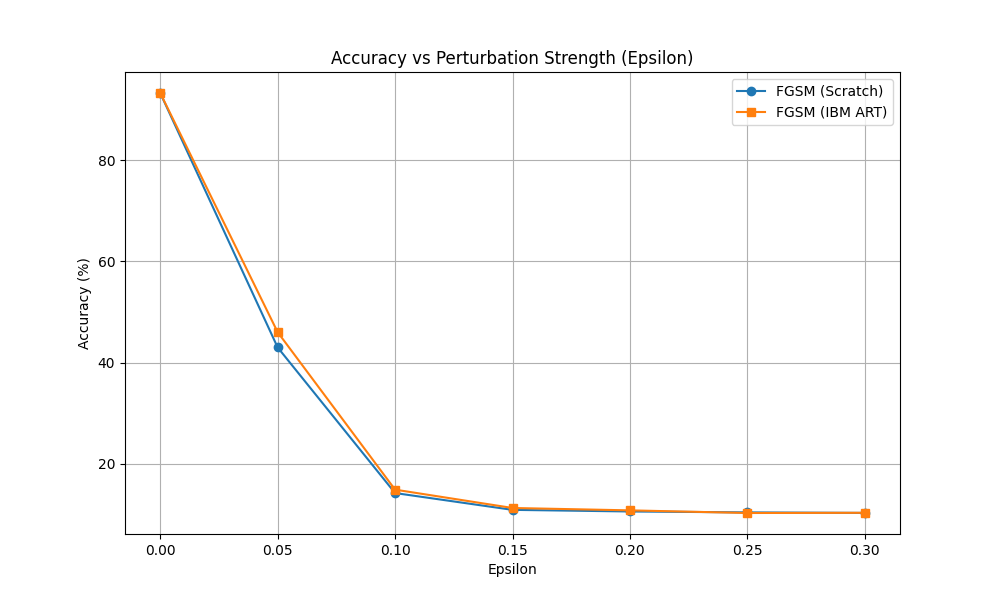

### FGSM Qualitative Samples

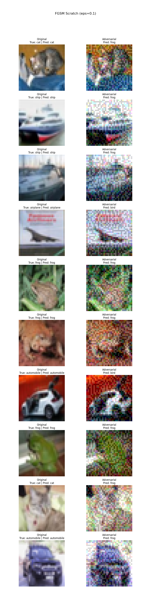


### FGSM Analysis

- The clean model is strong, so the attack comparison is meaningful.
- Both implementations show the expected monotonic drop in accuracy as epsilon increases.
- At `epsilon = 0.05`, both attacks already reduce performance sharply.
- From `epsilon = 0.10` onward, the classifier drops close to chance-level accuracy.
- Scratch FGSM and IBM ART FGSM behave very similarly, supporting the correctness of the from-scratch implementation.

## Q2 Adversarial Detection Using ResNet34

Source: [`output/q2_adversarial/detector_accuracy_comparison.csv`](output/q2_adversarial/detector_accuracy_comparison.csv)

| Attack | Best Validation Accuracy (%) | Test Accuracy (%) | Meets 70% Target |
|--------|------------------------------:|------------------:|------------------|
| PGD | 99.99 | 100.00 | True |
| BIM | 100.00 | 99.99 | True |

### PGD Detector

Source: [`output/q2_adversarial/pgd_detector_train_val_table.csv`](output/q2_adversarial/pgd_detector_train_val_table.csv)

| Epoch | Train Loss | Train Accuracy (%) | Val Loss | Val Accuracy (%) | LR |
|------:|-----------:|-------------------:|---------:|-----------------:|---:|
| 1 | 0.060190 | 97.2467 | 0.001473 | 99.97 | 0.000289 |
| 2 | 0.001586 | 99.9478 | 0.002609 | 99.94 | 0.000256 |
| 3 | 0.001391 | 99.9544 | 0.001549 | 99.95 | 0.000207 |
| 4 | 0.000616 | 99.9789 | 0.000292 | 99.98 | 0.000150 |
| 5 | 0.000120 | 99.9967 | 0.000691 | 99.97 | 0.000093 |
| 6 | 0.000045 | 99.9978 | 0.000614 | 99.98 | 0.000044 |
| 7 | 0.000002 | 100.0000 | 0.000482 | 99.98 | 0.000011 |
| 8 | 0.000001 | 100.0000 | 0.000372 | 99.99 | 0.000000 |

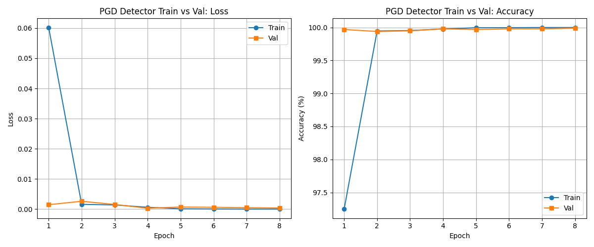


### BIM Detector

Source: [`output/q2_adversarial/bim_detector_train_val_table.csv`](output/q2_adversarial/bim_detector_train_val_table.csv)

| Epoch | Train Loss | Train Accuracy (%) | Val Loss | Val Accuracy (%) | LR |
|------:|-----------:|-------------------:|---------:|-----------------:|---:|
| 1 | 0.077927 | 96.3000 | 0.012274 | 99.70 | 0.000289 |
| 2 | 0.002980 | 99.9033 | 0.003647 | 99.87 | 0.000256 |
| 3 | 0.001343 | 99.9578 | 0.000454 | 99.99 | 0.000207 |
| 4 | 0.001117 | 99.9644 | 0.002979 | 99.91 | 0.000150 |
| 5 | 0.000601 | 99.9889 | 0.000176 | 100.00 | 0.000093 |
| 6 | 0.000137 | 99.9956 | 0.000468 | 99.98 | 0.000044 |
| 7 | 0.000021 | 100.0000 | 0.000346 | 99.99 | 0.000011 |
| 8 | 0.000032 | 99.9989 | 0.000421 | 99.98 | 0.000000 |

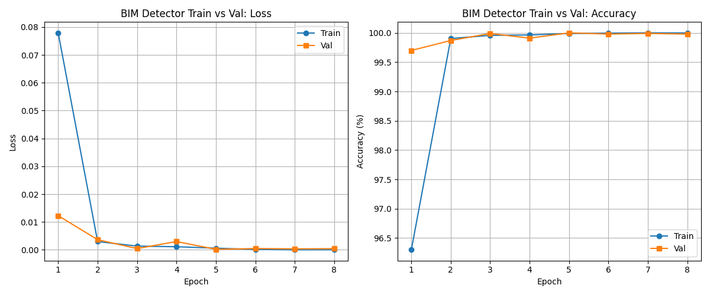

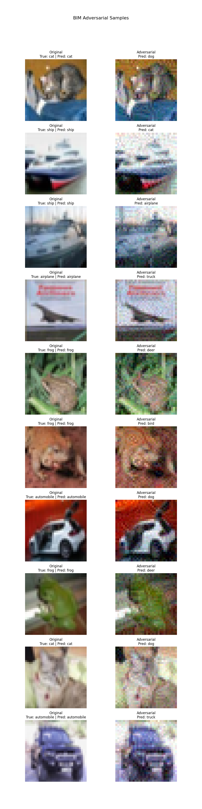

### Detector Analysis

- Both detectors exceed the assignment threshold of **70%** by a very large margin.
- PGD detection reached **100.00%** test accuracy.
- BIM detection reached **99.99%** test accuracy.
- The difference between PGD and BIM detector performance is negligible in this run.
- The train-val curves show fast and stable convergence.

## Q2 Saved Weights and Artifacts

- [`output/q2_adversarial/resnet18_clean.pth`](output/q2_adversarial/resnet18_clean.pth)
- [`output/q2_adversarial/detector_PGD.pth`](output/q2_adversarial/detector_PGD.pth)
- [`output/q2_adversarial/detector_BIM.pth`](output/q2_adversarial/detector_BIM.pth)
- [`output/q2_adversarial/q2_adversarial.log`](output/q2_adversarial/q2_adversarial.log)

---

## Notes

- The Q1 best LoRA adapter was uploaded to Hugging Face at [ByteMaster01/ViT-S-LoRA-CIFAR100](https://huggingface.co/ByteMaster01/ViT-S-LoRA-CIFAR100).
- The full experimental histories, tables, and qualitative results are also logged on WandB at [MLOps-Assignment-5](https://wandb.ai/b23cs1037-iit-jodhpur/MLOps-Assignment-5?nw=nwuserb23cs1037).
- The PDF report for submission is generated from LaTeX and compiled separately as part of this repository update.
